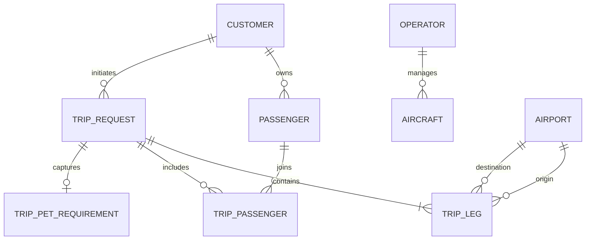
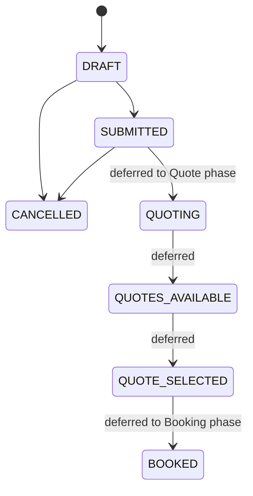

# Phase 2 Core Private Aviation Domain

## Scope

Phase 2 introduces the first business-domain module:
`sky_bridge_jet.modules.core_aviation`. It remains a synchronous SQLAlchemy
modular monolith. API routes call focused application services; services own
write transactions and coordinate explicit repositories; repositories own
SQLAlchemy queries and never commit.

The domain intentionally includes only request preparation:

- Customer: the business party making a request, not an authentication principal.
- Passenger: a separately owned traveller, which may be the customer, a family
  member, colleague, guest, or executive.
- Airport: a reference entity identified independently by mandatory ICAO and
  optional IATA codes.
- Operator and Aircraft: prospective supply reference data, without availability
  or certification claims.
- TripRequest: the aggregate containing one or more TripLegs, passenger
  associations, and minimal trip requirements.



All primary keys are application-generated UUIDs. Persisted timestamps are
timezone-aware UTC values. A leg stores its UTC departure time plus the origin
and destination IANA timezone identifiers so its local airport context remains
unambiguous. Coordinates and pet weights use fixed precision decimals; Phase 2
has no money fields.

## Trip request lifecycle

The complete approved lifecycle vocabulary is preserved:



Only `DRAFT -> SUBMITTED`, `DRAFT -> CANCELLED`, and
`SUBMITTED -> CANCELLED` are executable in Phase 2. The later state names are
explicitly retained but cannot be reached until Quote and Booking domains
exist. Transition rules live in `TripRequestService`, not in route handlers.

Mutable TripRequest writes require the client to send the current
`expected_version`. SQLAlchemy also maps the aggregate version column as an
optimistic concurrency token, so a concurrent update is rejected rather than
silently overwriting the earlier state.

## Validation and data minimization

The module validates IATA/ICAO formats, ISO-style country and currency codes,
IANA timezones, normalizes email and aircraft registrations, requires
positive aircraft capacity and leg passenger count, and rejects identical leg
origin and destination airports. It allows one-way, round-trip, and multi-leg
requests through an ordered leg list.

Trip requirements deliberately use a compact aggregate shape: baggage and
catering notes, ground-transport flag, special-assistance notes, customer
notes, and at most one structured pet requirement. Passport, identity document,
medical, veterinary, payment, and compliance data are not collected.

Passenger and itinerary data are sensitive personal and travel information.
The API does not log request bodies, validation responses omit submitted input
values, and persistence failures do not expose database internals. This design
supports privacy review but does not claim GDPR or other regulatory compliance.

## Transactions and persistence

`CustomerService`, `OperatorService`, and `TripRequestService` use a single
explicit `Session.begin()` scope per write use case. Repositories flush only as
needed and do not independently commit, preventing partial multi-record writes.
Customer, passenger, operator, and airport foreign keys use restrictive
deletion. Aggregate-owned legs, passenger associations, and pet requirements
are the only cascading dependent records.

Alembic discovers `models.py` modules under bounded contexts per ADR-010. The
Phase 2 migration is `20260810_0002`; it creates PostgreSQL enum types,
constraints, indexes, and safe reverse migration order. Downgrading removes
only Phase 2 tables and their enum types, and is intended for development or
controlled rollback rather than a production data-retention operation.

## Development airport seed

The following small, deterministic reference dataset is development/demo data
only, not a complete airport database: Dublin, Farnborough, Paris-Le Bourget,
Nice, Geneva, Zurich, Milan Linate, Madrid, and Barcelona. Each seed airport
uses a stable UUID5 derived from its ICAO code. Loading is idempotent.

```sh
make migrate
make seed-airports
```

For Compose:

```sh
make migrate-compose
make seed-airports-compose
```

## API

All endpoints are below `/api/v1` and use Pydantic contracts. FastAPI serves
the corresponding OpenAPI schema at `/openapi.json`.

| Resource | Operations |
| --- | --- |
| Customers | `POST /customers`, `GET /customers/{id}` |
| Passengers | `POST /passengers`, `GET /passengers/{id}` |
| Airports | `GET /airports`, `GET /airports/{id}` |
| Operators | `POST /operators`, `GET /operators/{id}` |
| Aircraft | `POST /aircraft`, `GET /aircraft/{id}` |
| Trip requests | `POST /trip-requests`, `GET /trip-requests/{id}`, `POST /trip-requests/{id}/submit`, `POST /trip-requests/{id}/cancel` |

Create the Customer and any Passenger records first, then use their response
IDs in the request. The airport IDs below are the deterministic Dublin (EIDW)
and Farnborough (EGLF) development/demo seed values. Developers can always
retrieve the current seeded resources with `GET /api/v1/airports`.

Example draft request:

```json
{
  "customer_id": "<customer-id-returned-by-POST-/api/v1/customers>",
  "passenger_ids": ["<passenger-id-returned-by-POST-/api/v1/passengers>"],
  "legs": [
    {
      "origin_airport_id": "68f5388c-2fe1-5fa4-94b7-cbd46f0f52b4",
      "destination_airport_id": "9a41e704-11f9-5d8c-ba0c-1c3e9dd49322",
      "departure_at": "2026-09-01T14:00:00+00:00",
      "passenger_count": 1
    }
  ],
  "requirements": {
    "ground_transport_requested": true,
    "pet": {"pet_type": "DOG", "approximate_weight_kg": "8.5"}
  }
}
```

State commands require an optimistic version:

```json
{"expected_version": 1}
```

Validation, not-found, state-transition/concurrency conflict, and persistence
failures use the safe envelope:

```json
{
  "error": {
    "code": "validation_error",
    "message": "Request validation failed",
    "details": [{"location": ["body", "primary_email"], "message": "...", "type": "..."}]
  }
}
```

## Explicit Phase 2 non-goals

Phase 2 does not implement Quote, pricing, Booking, Payment, Empty Legs, real
provider or airport data integrations, authentication or identity workflows,
portals, notifications, dispatch, crew scheduling, flight operations,
regulatory/compliance workflows, or AI. It introduces no microservices,
generic repository framework, speculative events, or fake future aggregates.
