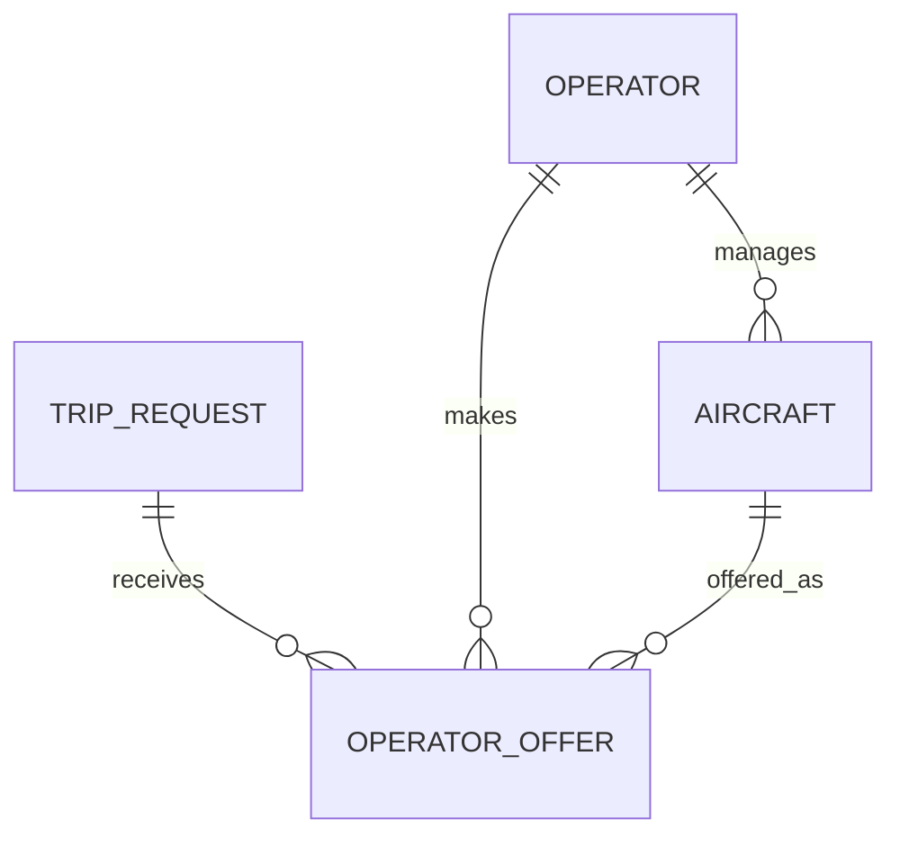
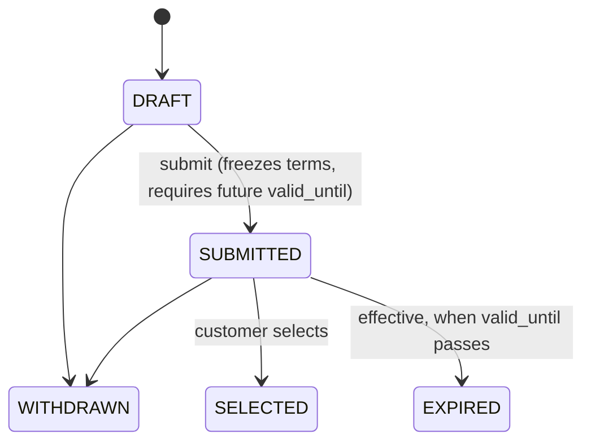

# Phase 3 Quotes & Operator Offers

## Business purpose

Phase 2 established the demand side: a Customer prepares a TripRequest with legs,
passengers, and requirements, and submits it. Phase 3 adds the first commercial
supply-response layer. One or more Operators respond to a submitted TripRequest
with commercially comparable offers, and the Customer compares valid offers and
selects one.

Selection is **commercial intent only**. It is not a booking: no money changes
hands, and no contract, payment, provider reservation, or confirmed flight is
created. Phase 3 ends exactly when a customer has selected a commercially valid
operator offer.

## Domain model

Phase 3 introduces one aggregate, `OperatorOffer`, in a new bounded-context
module `sky_bridge_jet.modules.offers`. It reuses the Phase 2 architecture:
routes call a focused service, the service owns one explicit transaction per
write, and repositories never commit.

An `OperatorOffer` belongs to exactly one TripRequest, one Operator, and one
Aircraft. The offered aircraft must belong to the offering operator, enforced by
a composite foreign key. An operator may make several offers for one TripRequest
when they represent genuinely different aircraft/commercial options; duplicate
active offers for the same trip/operator/aircraft are prevented.

Monetary amounts are integer minor units (ADR-013). Operator and aircraft
identity (`operator_legal_name`, `aircraft_registration`, `aircraft_manufacturer`,
`aircraft_model`, `aircraft_category`) are snapshotted onto the offer so it stays
historically meaningful if that reference data later changes. No customer or
passenger PII is copied onto offers.

## Offer lifecycle

Persisted states are `DRAFT`, `SUBMITTED`, `WITHDRAWN`, and `SELECTED`.
`EXPIRED` is an **effective** status derived from `valid_until` and the current
time; it is never stored, so no background scheduler is required (ADR-015).
`WITHDRAWN`, `SELECTED`, and effective `EXPIRED` cannot be selected.

## Price model

Each offer stores, in one currency (EUR, GBP, or USD):

| Field | Meaning |
| --- | --- |
| `operator_amount_minor` | Operator base price |
| `platform_fee_minor` | Sky Bridge Jet commercial fee (derived) |
| `tax_amount_minor` | Taxes/fees |
| `total_amount_minor` | Final customer price = operator + fee + tax |

All amounts are non-negative integer minor units. Consistency
(`total = operator + fee + tax`) and non-negativity are enforced in the domain
**and** by PostgreSQL `CHECK` constraints. There is no floating point and no FX.

## Platform-fee boundary

Operator price, Sky Bridge Jet fee, and customer price are three distinct fields
(ADR-014). The platform fee is derived by a single pure policy function,
`compute_platform_fee_minor`, using a default basis-points rate
(`DEFAULT_PLATFORM_FEE_BPS`). Clients never supply the fee; creation and update
recompute it. The long-term commission model can replace this one function
without touching the aggregate, schema, or API. This is deliberately not a
pricing engine.

## Quote immutability and revision

Only `DRAFT` offers are mutable. Submission freezes commercial terms. To change a
submitted offer, an operator withdraws it and creates a replacement — historical
commercial facts are never silently overwritten (ADR-015).

## Expiration semantics

Every submitted offer has a required timezone-aware UTC `valid_until` that must
be in the future at submission. Effective expiration is evaluated against the
current UTC time whenever an offer is read or a command runs. Expiration is
therefore deterministic and testable without infrastructure, and an expired
offer is rejected for selection.

## Selection semantics

A customer selects an offer for a trip via
`POST /trip-requests/{trip_request_id}/offers/{offer_id}/select`. Selection
verifies that: the offer belongs to that TripRequest; the TripRequest is not
cancelled; the offer is `SUBMITTED`; the offer is not effectively expired; and no
offer is already selected for the trip. On success the offer becomes `SELECTED`.
The Phase 2 `TripRequest` lifecycle is intentionally unchanged — selection is
recorded on the offer.

Authorization is deferred (see Authentication boundary), so the "customer
context" is represented by the TripRequest in the path rather than an
authenticated principal.

## Concurrency strategy

Selection acquires a `SELECT ... FOR UPDATE` row lock on the TripRequest so that
concurrent selections for the same trip serialize; the loser observes the
existing selection and is rejected with a safe 409. The database is the ultimate
guarantee: a partial unique index makes two selected offers for one trip
physically impossible (ADR-012, ADR-015). A real-PostgreSQL concurrency test
drives two simultaneous selections and asserts exactly one succeeds.

## Database invariants

Enforced in PostgreSQL, not application code alone:

- Offered aircraft belongs to the offering operator — composite FK
  `(aircraft_id, operator_id) -> aircraft(id, operator_id)`.
- Monetary non-negativity and `total = operator + fee + tax` — `CHECK` constraints.
- Supported currency — `CHECK currency IN ('EUR','GBP','USD')`.
- At most one selected offer per trip — partial unique index
  `WHERE status = 'SELECTED'`.
- No duplicate active offer per trip/operator/aircraft — partial unique index
  `WHERE status IN ('DRAFT','SUBMITTED','SELECTED')`.
- Referential integrity to trip request, operator, and aircraft (RESTRICT).

## API surface

All routes are under `/api/v1` and use Pydantic contracts and the shared safe
`ErrorResponse` envelope.

| Operation | Endpoint |
| --- | --- |
| Create draft offer | `POST /offers` |
| Retrieve offer | `GET /offers/{offer_id}` |
| Update draft offer | `PATCH /offers/{offer_id}` |
| Submit offer | `POST /offers/{offer_id}/submit` |
| Withdraw offer | `POST /offers/{offer_id}/withdraw` |
| List offers for a trip | `GET /trip-requests/{trip_request_id}/offers` |
| Select offer | `POST /trip-requests/{trip_request_id}/offers/{offer_id}/select` |

Listing returns offers in a deterministic order (total price ascending, then
longer validity, then creation time, then id). Cross-currency totals are not
FX-normalized; ordering is for stable presentation, not ranking. Responses
document 404 (not found), 409 (conflict: lifecycle/eligibility/selection), and
the app-wide 422 (validation) and 500 (safe persistence failure). No
SQLAlchemy/database internals are exposed in errors.

## Authentication boundary

Authentication and authorization remain intentionally deferred, consistent with
Phase 2. Phase 3 does not implement an auth system. Service methods are, however,
scoped by actor role — operators create/update/submit/withdraw offers; customers
select them — so future authorization can wrap these boundaries without a
redesign. An unauthenticated public API is not production authorization.

## Explicit Phase 4 boundary

Phase 3 ends when a customer has selected a commercially valid operator offer.
The resulting state means "customer has selected this commercial offer" — not
"flight is booked". Phase 4 will address the next transactional boundary,
expected to include booking/reservation orchestration and related workflow
decisions. Phase 3 implements no booking, payment, payment authorization, PSP,
contracts/e-signatures, invoices, provider integrations, empty legs, AI,
recommendation/ranking, FX, notifications, portals, or messaging.

## Acceptance criteria

- Offers can be created only for `SUBMITTED` trip requests; `DRAFT` and
  `CANCELLED` cannot receive offers.
- An offer references one trip request, one operator, and one aircraft, and the
  aircraft belongs to the operator (service and database enforced).
- Money is integer minor units; components are non-negative and consistent
  (service and database enforced); currency is EUR/GBP/USD.
- Operator price, platform fee, and customer price are distinct; the fee is
  derived by a replaceable policy.
- Only draft offers are mutable; submission freezes terms and requires a future
  `valid_until`.
- Offer lifecycle transitions are explicit; withdrawn/expired offers cannot be
  selected.
- A trip request has at most one selected offer, guaranteed under concurrency by
  the database.
- Selection creates no booking, payment, contract, or reservation.
- OpenAPI documents 404/409/422/500 with the safe envelope and leaks no database
  internals; Phase 2 contracts remain intact.
