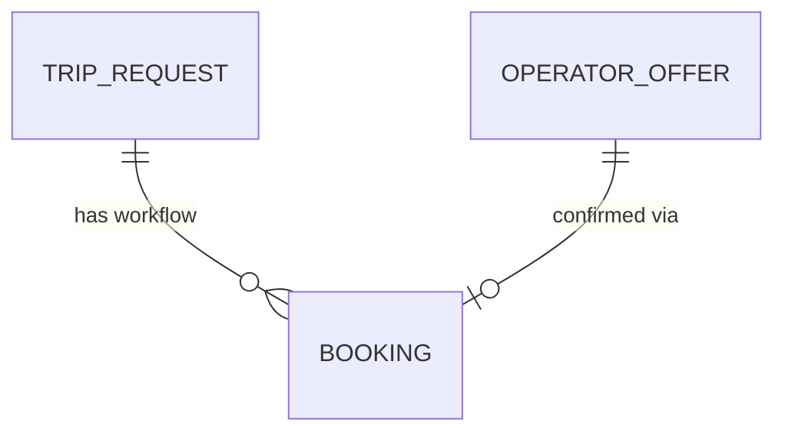
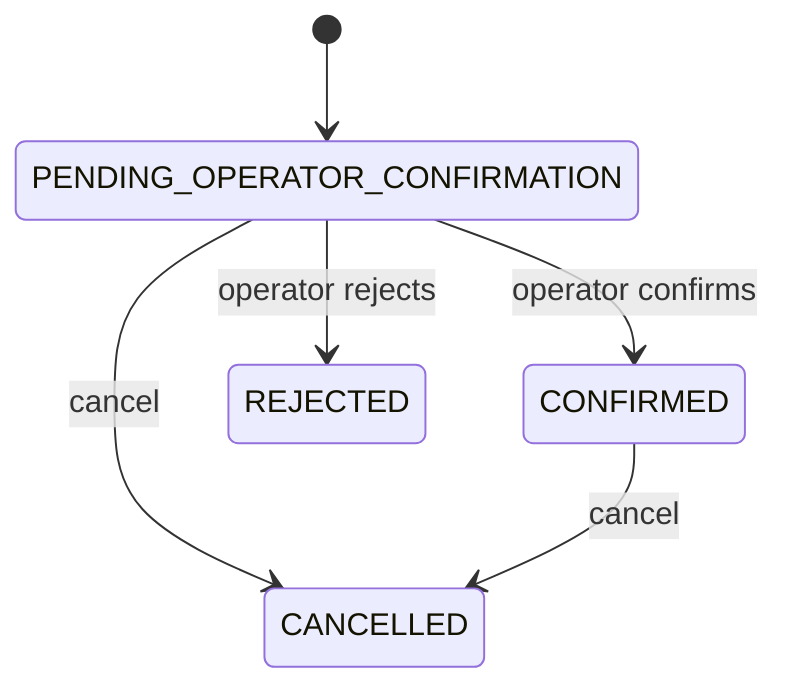

# Phase 4 Booking & Reservation Orchestration

## Business purpose

Phase 3 ended when a customer selected a commercially valid operator offer —
commercial intent, not a confirmed flight. Phase 4 adds the next controlled
transactional workflow that turns a selected offer into a booking the responsible
operator can confirm or reject:

```
Selected Operator Offer -> Booking (pending) -> Operator Confirmation -> Confirmed Booking
Selected Operator Offer -> Booking (pending) -> Operator Rejection
```

The fundamental distinction is **SELECTED OFFER ≠ CONFIRMED BOOKING**. Sky Bridge
Jet may only represent a flight as booked once the operator confirms. Phase 4
collects no money, calls no real operator/provider reservation API, and creates
no contract; it establishes the internal orchestration domain those integrations
will later drive.

## Booking domain

A new `sky_bridge_jet.modules.bookings` bounded context adds one aggregate,
`Booking`, following the established pattern: routes call a service that owns one
explicit transaction per write; repositories never commit.



One Booking corresponds to the workflow of one selected offer. It stores foreign
keys to the trip request, the selected offer, the operator, and the aircraft,
plus an immutable commercial snapshot and lifecycle metadata. The Booking — not
the `TripRequest` — is the authoritative source of booking state (ADR-016).

## Selected-offer prerequisite

A Booking may be created only when the offer exists and belongs to the given
trip, the offer is `SELECTED` (not draft, submitted, or withdrawn), the offer is
still within its validity window, the trip request is not cancelled, and no
active booking already exists for the trip. Phase 3 selection semantics are
unchanged.

## Lifecycle / state machine (ADR-017)



`REJECTED` and `CANCELLED` are terminal. Every other transition
(`REJECTED -> CONFIRMED`, `CANCELLED -> CONFIRMED`, `CONFIRMED -> PENDING`, …)
fails deterministically with a safe 409.

## Operator confirmation

Confirmation is an operator action. It verifies the booking exists, is pending,
that the acting operator matches the booking's operator, and that the selected
offer is still the authoritative basis. It records `confirmed_at` and an optional
operator confirmation reference (≤100 chars) and note (≤500 chars). No external
provider confirmation id is fabricated; the internal booking reference remains
sufficient when none exists.

## Operator rejection

Rejection is an operator action from the pending state. It records `rejected_at`,
a required structured `RejectionReason`
(`AIRCRAFT_UNAVAILABLE`, `SCHEDULE_CONFLICT`, `OPERATIONAL_RESTRICTION`,
`COMMERCIAL_WITHDRAWAL`, `OTHER`) and an optional note. It never deletes the
booking, and it does not auto-select another offer.

## Cancellation boundary

Cancellation is workflow state only, allowed from pending or confirmed. It
records `cancelled_at`, the initiating `CancellationActor`
(`CUSTOMER`/`OPERATOR`/`PLATFORM`), an optional structured reason, and an
optional note. Phase 4 computes **no** cancellation penalties, refunds, credits,
payment reversals, or invoice adjustments — those belong to a later
transactional/payment phase.

## Commercial snapshot & price immutability

At creation the Booking copies the offer's currency, operator amount, platform
fee, tax, total (integer minor units, ADR-013), validity, and operator/aircraft
identity strings. The snapshot is immutable: Phase 4 exposes **no**
booking-price-edit endpoint. Consistency (`total = operator + fee + tax`) and
non-negativity are enforced by `CHECK` constraints. No floating point, no FX, no
passenger PII.

## Booking reference (ADR-019)

Each booking has an opaque `reference` `SBJ-<16 hex>` from 64 random bits: unique,
non-secret, non-sequential, not derived from customer data, safe to log.
Uniqueness is guaranteed by a database `UNIQUE` constraint.

## Concurrency & idempotency (ADR-018)

Creation locks the trip row (`FOR UPDATE`) and is backstopped by a partial unique
index `bookings(trip_request_id) WHERE status IN
('PENDING_OPERATOR_CONFIRMATION','CONFIRMED')`, so concurrent creations yield
exactly one active booking. Confirmation/rejection/cancellation lock the booking
row and re-validate, so confirm/reject and confirm/cancel races resolve to one
valid terminal state. Repeated create returns a deterministic 409; repeated
terminal commands return a deterministic `invalid_booking_state` 409. No
distributed idempotency-key platform is introduced.

## PostgreSQL invariants

- Booking ↔ offer/trip/operator/aircraft agreement — one composite foreign key
  into `operator_offers(id, trip_request_id, operator_id, aircraft_id)`.
- Direct referential integrity to `trip_requests` (RESTRICT).
- Monetary non-negativity and `total = operator + fee + tax` — `CHECK`.
- Supported currency — `CHECK currency IN ('EUR','GBP','USD')`.
- One active booking per trip — partial unique index.
- Unique internal reference — `UNIQUE` constraint.
- Structured enums for status, rejection reason, cancellation actor/reason.

## API

| Operation | Endpoint |
| --- | --- |
| Create booking from selected offer | `POST /bookings` |
| Retrieve booking | `GET /bookings/{booking_id}` |
| Retrieve a trip's booking | `GET /trip-requests/{trip_request_id}/booking` |
| Confirm booking | `POST /bookings/{booking_id}/confirm` |
| Reject booking | `POST /bookings/{booking_id}/reject` |
| Cancel booking | `POST /bookings/{booking_id}/cancel` |

Responses use the shared safe `ErrorResponse` envelope and document 404
(not found), 409 (conflict: lifecycle/eligibility/operator-mismatch), plus the
app-wide 422 (validation) and 500 (safe persistence failure). No
SQLAlchemy/PostgreSQL internals leak.

## Authorization boundary

Authentication/authorization remains intentionally deferred. The acting operator
is supplied explicitly on confirmation/rejection and verified against the
booking's operator; cancellation records its actor. Commands are cleanly scoped
by actor role (customer/platform create and cancel; operator confirms/rejects),
so future authorization can wrap them without redesign. An unauthenticated API is
not production authorization.

## Provider-integration boundary

Phase 4 calls no real provider (Avinode, Schedaero, Leon, FlightBridge) and ships
no mock pretending to be one. The Booking domain is provider-neutral: a future
adapter can perform request/confirm/reject/cancel reservation against these same
lifecycle commands without rewriting the domain. No speculative empty port
interface is added now (it would carry no current value).

## Payment boundary

Payment is out of scope. Confirmation is not conditional on any payment flow. The
ordering among customer payment authorization, operator confirmation, and booking
confirmation is a future-phase commercial decision and is deliberately not
invented here.

## Legal / contract boundary

No charter contract generation, e-signature, legal acceptance, cancellation-fee
calculation, or regulatory document collection. A Booking may hold references and
metadata for future contracts but creates no legal-contract subsystem.

## Explicit Phase 5 boundary

Phase 4 ends when the system can truthfully represent "an operator has confirmed
this selected commercial offer as a booking" or "the operator rejected/cancelled
the booking workflow." It does **not** establish "customer has paid." Phase 5 is
expected to address the transactional/payment boundary and the relationship among
booking, payment authorization, payment capture, operator confirmation, and
customer financial commitment.

## Acceptance criteria

- A booking is created only from a `SELECTED`, in-validity offer belonging to a
  non-cancelled trip; draft/submitted/withdrawn offers and cancelled trips are
  rejected.
- Booking ↔ offer/trip/operator/aircraft agreement is database-enforced.
- At most one active booking per trip, guaranteed under concurrency; rejected and
  cancelled bookings remain as history.
- The commercial snapshot is copied exactly, consistent, non-negative, integer
  minor units, and immutable (no edit endpoint).
- Every booking has a unique, opaque, non-PII reference.
- Operator confirmation and rejection verify the operator and the pending state;
  rejection uses structured reasons and preserves history.
- Cancellation records actor/reason without financial settlement.
- Illegal lifecycle transitions fail deterministically; repeated commands are
  deterministic.
- OpenAPI documents 404/409/422/500 with the safe envelope and leaks no
  database internals; Phase 2/3 contracts remain intact.
