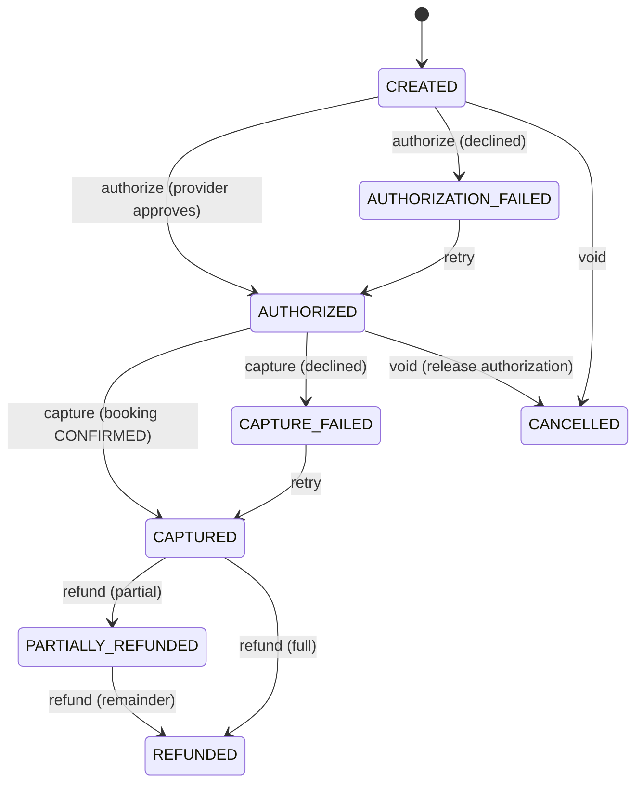

# Phase 5 Payment & Settlement Core

## Business purpose

Phase 4 ended with an operator-confirmed booking. Phase 5 establishes the
internal, provider-neutral **financial state machine** around a booking: how much
the customer is expected to pay, which portion is the operator's, which is Sky
Bridge Jet's platform fee, and the payment's authorization / capture / refund and
settlement-eligibility state. **No real funds move**, no live payment credentials
are connected, and no real PSP is called.

## Disclosed-intermediary working assumption

This phase is built on the approved **working architectural hypothesis** (not a
final legal/tax opinion) that Sky Bridge Jet operates as a **disclosed
intermediary / managed marketplace**: the licensed air operator remains the
supplier and operator of the flight; Sky Bridge Jet earns a separately
identifiable **platform fee** and intends to handle funds through a **licensed
payment service provider**, not by taking custody or transmitting money itself.
The software does not assert that this structure satisfies PSD2, VAT, tax,
Merchant-of-Record, or aviation-law requirements — those are specialist-review
gates below.

## Operator vs platform economic roles

The customer total is economically split and kept technically distinct
(ADR-023): operator amount, Sky Bridge Jet platform fee, and the approved tax
component from the Phase 3/4 commercial snapshot. The platform never treats the
whole customer payment as its own revenue. Payment amounts are integer minor
units — no floating point, no FX (ADR-013).

## Payment lifecycle

Financial success is recorded from the provider result, never inferred from
booking state. Illegal transitions fail deterministically with a safe 409.

## Authorization-before-confirmation / capture-after-confirmation

The approved default flow (ADR-021): a payment may be created and **authorized**
while the booking is `PENDING_OPERATOR_CONFIRMATION` or `CONFIRMED`; **capture
requires `CONFIRMED`**, verified under a `FOR UPDATE` lock on the booking row so a
concurrent cancellation cannot interleave. If the booking is rejected or
cancelled after authorization, capture is refused and the authorization is
released by an explicit **void** — a void (authorization release) and a
post-capture **refund** are different financial events and are never conflated.

## Provider capability caveat

Not every payment method supports delayed capture, and authorization validity
periods vary. Provider/payment-method capability is kept explicit; the domain
invents no authorization-expiry value and depends on no Stripe/Adyen terminology.

## Money snapshot

Each payment snapshots the booking's `currency`, `operator_amount_minor`,
`platform_fee_minor`, `tax_amount_minor`, and `total_amount_minor`, bound to the
booking by a six-column composite foreign key so the commercial basis cannot
diverge. Supported currencies remain EUR, GBP, USD; one payment uses one
currency. The booking's historical commercial snapshot is authoritative — the
payment never silently reprices with a newer fee policy, and there is no
edit-amount endpoint (ADR-023).

## Payment / operations design

One `Payment` aggregate per booking (`UNIQUE(booking_id)`) holds status and the
running `authorized` / `captured` / `refunded` totals. A `payment_operations`
ledger records every command with a unique idempotency key, doubling as the
attempt/audit trail; refund operations are the refund history (ADR-020).

## Idempotency

Every financial command carries a bounded, opaque, client-supplied idempotency
key stored uniquely in `payment_operations`. Commands lock the payment row, then
replay on a repeated key, reject a key reused for a different operation
(`idempotency_conflict`), and are backstopped by the unique constraint under
concurrency. Payment creation is idempotent per booking. Keys are never logged
(ADR-022).

## Refunds

Refunds are permitted only from `CAPTURED` / `PARTIALLY_REFUNDED`, never exceed
`captured - refunded` (service check plus `CHECK(refunded <= captured)` plus row
locking), use the payment currency, preserve history, and distinguish partial vs
full. No cancellation-fee, VAT, or refund-policy amount is auto-calculated
(ADR-024).

## Allocation

`GET /payments/{id}/allocation` exposes the economically distinct operator
amount, platform fee, tax, customer total, captured and refunded amounts, and the
settlement eligibility — making explicit that captured customer money is not
platform revenue.

## Settlement vs capture

Capture means the (future) PSP collected customer money; **settlement** means the
operator's economic share becomes payable/paid, which is a different event. Phase
5 exposes only orchestration **eligibility**: `ELIGIBLE` when the payment is fully
captured (unreduced by refunds) and the booking is `CONFIRMED`, else
`NOT_ELIGIBLE`. This is **not** a payout-timing policy; no funds move, no payout
timing is implemented, and refund apportionment across operator/platform is
deferred policy.

## Provider port / fake provider

The payment domain talks only to a provider-neutral `PaymentProvider` port
(`authorize`, `capture`, `void`, `refund`) returning typed results; raw provider
exceptions never cross the adapter boundary. Phase 5 ships only a deterministic,
in-process `FakePaymentProvider` — unmistakably non-production, no external calls,
no real credentials (ADR-025). Provider webhook/event ingestion is a documented
future boundary, not built while there is no real PSP.

## Database invariants

- One payment per booking — `UNIQUE(booking_id)`.
- Payment commercial snapshot equals the booking's — six-column composite FK.
- Non-negativity and `total = operator + fee + tax` — `CHECK`.
- `captured <= authorized` and `refunded <= captured` — `CHECK`.
- Supported currency — `CHECK`.
- Unique idempotency key per operation, unique payment reference.

## API

| Operation | Endpoint |
| --- | --- |
| Create payment for booking | `POST /bookings/{booking_id}/payment` |
| Get booking payment | `GET /bookings/{booking_id}/payment` |
| Get payment | `GET /payments/{payment_id}` |
| Authorize | `POST /payments/{payment_id}/authorize` |
| Capture | `POST /payments/{payment_id}/capture` |
| Void authorization | `POST /payments/{payment_id}/void` |
| Create refund | `POST /payments/{payment_id}/refunds` |
| List refunds | `GET /payments/{payment_id}/refunds` |
| Allocation & settlement eligibility | `GET /payments/{payment_id}/allocation` |

Responses use the shared safe `ErrorResponse` envelope and document 404, 409,
422, and 500. No SQLAlchemy/PostgreSQL/provider internals leak.

## Authorization boundary

Authentication/authorization remains deferred. The acting operator is not
required for customer/platform-initiated payment commands in Phase 5; command
boundaries are role-scoped so future authorization (customer vs operator vs
platform) can wrap them without redesign. An unauthenticated API is not
production authorization.

## Security / PCI-sensitive-data exclusion

Sky Bridge Jet stores **no** raw card/bank credentials: no PAN, CVV/CVC, track
data, PIN, bank password, or raw payment-method credential exists in any model,
schema, or log. Only provider-neutral references and idempotency keys are
persisted; idempotency keys and provider references are never proactively logged.
All prior guarantees hold: sanitized correlation IDs, no request-body PII
logging, safe persistence-error logging, no SQL exception leakage, no committed
secrets, safe error envelopes.

## Aviation-liability boundary

Payment state changes nothing about aviation responsibility: the operator remains
responsible for the flight, aircraft, AOC, operational control, and insurance.
No payment field implies aircraft ownership, operational control, or liability
transfer to Sky Bridge Jet.

## SPECIALIST REVIEW REQUIRED BEFORE PRODUCTION

The following are **not** solved by this software and require specialist review:

**LEGAL** — disclosed-intermediary/agency contract; customer terms; operator
agreement; Merchant-of-Record allocation; consumer law.

**PAYMENTS** — PSD2 / payment-services perimeter; PSP/platform configuration and
account model; charge model and statement descriptor; disputes/chargebacks; SCA
and payment-method requirements.

**TAX** — VAT treatment of the underlying charter; VAT treatment of the Sky Bridge
Jet commission; B2B/B2C place-of-supply; cross-border VAT; invoicing
responsibilities; corporation-tax/accounting recognition. The whole flight price
is **not** assumed to be Irish taxable revenue of Sky Bridge Jet; the operator
amount, intermediary fee, and tax component are kept separate.

**AVIATION** — operator AOC/permissions; operational control; insurance;
aircraft/operator legitimacy; route/operator compliance.

## Future provider adapter boundary

A future phase implements a licensed-PSP adapter behind the existing
`PaymentProvider` port (authorize/capture/void/refund/reconcile) plus provider
webhook ingestion (event id, deduplication, idempotent processing, typed mapping,
signature verification) — without rewriting the payment domain.

## Explicit Phase 6 boundary

Phase 5 ends with a robust internal, provider-neutral financial orchestration
core that safely represents obligation → authorization → capture → refund →
operator/platform allocation → settlement eligibility, **without moving live
money**. Phase 6 addresses the production-integration boundary (real PSP
selection/integration, onboarding/KYB, SCA/payment-method UX, live webhooks,
chargebacks/disputes, settlement configuration) **only after** the legal,
payment, and tax review decisions above are made. Phase 6 is not started.

## Acceptance criteria

- A payment is created only for a payable booking (not rejected/cancelled); one
  payment per booking, database-enforced; idempotent creation.
- Commercial snapshot copied exactly, consistent, non-negative, integer minor
  units, immutable, and database-bound to the booking.
- Authorization may precede confirmation; capture requires a confirmed booking
  and cannot occur against a rejected/cancelled booking, including under a
  capture-vs-cancel race.
- Booking rejection/cancellation after authorization releases via void, never an
  auto-refund; void and refund are distinct.
- Refunds never exceed captured; cumulative refunds tracked; partial/full
  distinguished; over-refund rejected; refunds idempotent and concurrency-safe.
- Financial commands are idempotent; concurrency yields no double
  authorize/capture, no double/over refund, no duplicate payment, no
  contradictory terminal state.
- Operator/platform/tax allocation is economically distinct; settlement
  eligibility is orchestration-only, never a payout.
- No raw payment credentials are stored or logged; safe errors; OpenAPI matches
  runtime; Phase 2–4 behaviour preserved.
- Legal/PSD2/tax/aviation matters are documented as review gates, not asserted
  solved.
