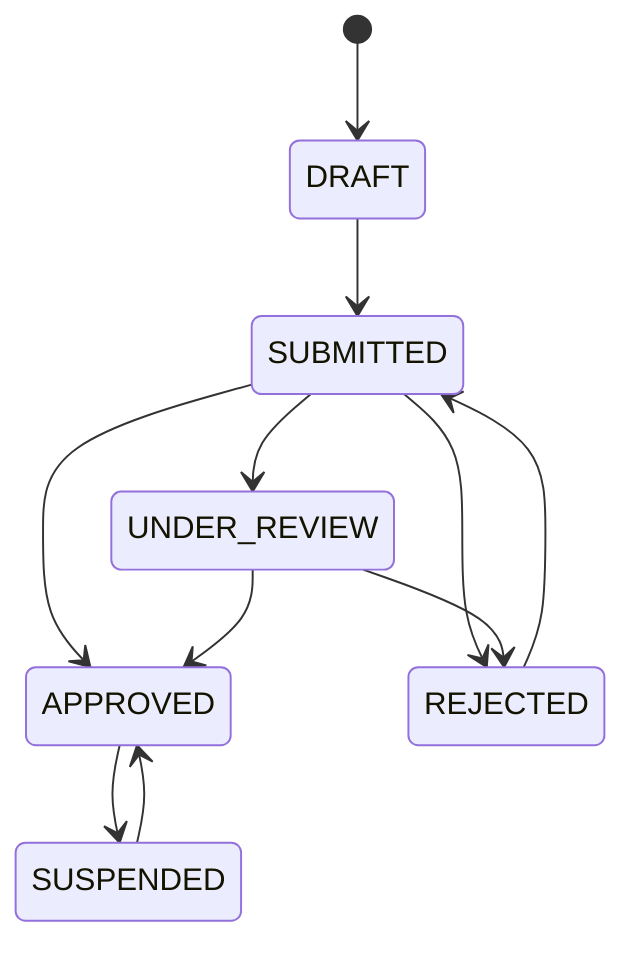

# Phase 6 Operator Compliance & Marketplace Admission

## Business purpose

Until Phase 6 the system assumed an operator and its aircraft were commercially
legitimate simply because the records existed. Phase 6 establishes the
marketplace-admission and aviation-compliance boundary that answers one question:
**"May this operator, using this aircraft, participate commercially in Sky Bridge
Jet's marketplace?"** — through structured evidence, platform review, validity
periods, relational invariants, and enforceable commercial gates.

## Marketplace admission vs government certification

Sky Bridge Jet performs **marketplace compliance review / admission**. It does
**not** issue AOCs, operating licences, government approvals, insurance,
airworthiness certificates, or aircraft ownership. Therefore `APPROVED` means
"admitted to the Sky Bridge Jet marketplace under the current compliance
procedure" — **not** "certified by a government to perform every possible flight."
This distinction is preserved in naming, API semantics, and code.

## Evidence → review → admission → gate

The four concepts are kept distinct (never collapsed):

1. **Evidence** — an operator supplying an AOC number or insurance policy is not
   approval; a document existing is not verification.
2. **Review** — a human-authorized platform reviewer verifies evidence and decides
   admission; a verified document does not by itself approve the whole operator.
3. **Admission** — operator admission does not automatically approve every
   aircraft.
4. **Gate** — a valid operator/aircraft combination is admitted to the
   marketplace, which is necessary but not sufficient for route-level legality.

## Operator admission lifecycle (ADR-026)

One `operator_admissions` row per operator (database unique). Existing operators
have **no** admission row and are therefore not admitted (no auto-approval).
Illegal transitions fail deterministically with a safe 409.

## Authority / AOC evidence model (ADR-027)

One provider-neutral `compliance_evidence` table with an `evidence_type`
discriminator (`OPERATING_AUTHORITY`, `INSURANCE`, `AIRCRAFT_OPERATING_AUTHORITY`,
`OTHER`) plus reference number, issuing authority, jurisdiction, insurer name,
`authority_basis`, validity window, and an opaque `storage_object_reference`.
AOC is a first-class operating-authority example; the model is not hard-coded to
one jurisdiction. No external regulator lookup or scraping is performed.

## Jurisdiction

Jurisdiction is stored as a normalized ISO country code on evidence. Phase 6
records evidence and review decisions only; it encodes **no** legal rule such as
"country X AOC is always accepted".

## Operator–aircraft commercial authority (ADR-028)

`operator_aircraft_authorizations` (unique per pair) records the `authority_basis`
(owned/leased/managed/operated-under-agreement/other) and its own explicit review
lifecycle. A composite foreign key enforces that the aircraft belongs to the
operator. Approval is explicit, never inherited, and does not imply ownership.

## Insurance & document/evidence lifecycle + effective expiration (ADR-027)

Insurance is modelled as evidence (insurer, reference, validity, review outcome).
No universal minimum coverage rule is encoded. Evidence lifecycle is
`SUBMITTED → {UNDER_REVIEW} → VERIFIED | REJECTED → SUPERSEDED`. **Expiration is
effective, not persisted**: verified evidence past its timezone-aware
`expiry_date` reports effective status `EXPIRED` and cannot satisfy a gate — no
scheduler required. Renewal uses supersession, preserving the old record and its
review history.

## Review actions & human-authorization boundary (ADR-030)

Review decisions require a human-authorized `actor_type` (`PLATFORM_REVIEWER` or
`PRODUCT_OWNER`); `SYSTEM`/`OPERATOR` are rejected. Authentication is deferred, so
an unauthenticated API call does not by itself prove human authorization — a
future auth layer binds `actor_type` to a real authenticated reviewer. AI must not
autonomously approve admission, authority validity, aircraft authority, insurance
sufficiency, or suspension restoration.

## Audit trail (ADR-030)

Every material change appends to `compliance_audit_events` (entity type/id,
action, previous/new status, actor type and optional non-PII reference, reason
code, bounded note, timestamp). Rows are insert-only — never updated or deleted —
and store no secrets or raw document contents.

## Eligibility model (ADR-029)

A single `ComplianceEvaluator` is the only place eligibility is decided and
returns explainable, structured reasons. **Operator eligibility** requires
`APPROVED` admission plus at least one currently-valid operating authority and
operator-level insurance. **Operator/aircraft eligibility** additionally requires
the aircraft to belong to the operator and the operator/aircraft authorization to
be `APPROVED`. Reasons include `OPERATOR_NOT_ADMITTED`, `OPERATOR_SUSPENDED`,
`AUTHORITY_EXPIRED`, `INSURANCE_EXPIRED`, `AIRCRAFT_NOT_AUTHORIZED`, etc.
Eligibility means "meets Sky Bridge Jet's configured Phase 6 admission
prerequisites", not route-level legality.

## Offer gate (ADR-029)

`OperatorOfferService.create` refuses to create an offer unless the operator and
that specific aircraft are currently eligible (safe 409 with structured reasons),
enforced in the domain/service layer. Tested failure modes: unreviewed, rejected,
suspended operator; expired authority; expired insurance; unapproved
operator/aircraft; plus the eligible success path. Phase 3 commercial invariants
are preserved.

## Booking confirmation recheck (ADR-029)

`BookingService.confirm` re-evaluates current operator/aircraft eligibility before
turning a booking `CONFIRMED`. A lapse (e.g. insurance expired or operator
suspended after the offer) blocks confirmation with a deterministic safe 409 and
does **not** mutate or cancel the booking; the offer and booking are preserved.

## Payment interaction safety

Phase 5 authorizes before confirmation. If compliance lapses while a payment is
`AUTHORIZED` and the booking is `PENDING_OPERATOR_CONFIRMATION`, confirmation is
blocked, and because capture already requires a `CONFIRMED` booking, the payment
cannot be captured. No automatic void or refund is triggered — the explicit
Phase 5 financial-resolution boundary is preserved.

## Suspension / revocation behaviour

Suspending an operator or operator/aircraft authorization blocks new offers and
booking confirmations that require current eligibility, but preserves existing
offers, bookings, payments, and commercial snapshots (no deletion, no silent
mutation, no automatic refund/cancellation). Restoration is an explicit legal
transition (`SUSPENDED → APPROVED`).

## Concurrency

Gates evaluate with `SELECT … FOR UPDATE` on the admission and authorization rows,
so a suspend-vs-offer or suspend-vs-confirm race serializes: a suspension that
commits first blocks the commercial action; a commercial action that commits first
completed while compliant. Concurrent approvals and concurrent evidence
verifications resolve to a single winner (the loser gets a deterministic 409).
Real-PostgreSQL tests cover these.

## Database invariants

- One admission per operator; one authorization per operator/aircraft pair
  (unique constraints).
- Aircraft-scoped evidence and authorizations belong to the operator (composite
  foreign keys).
- Validity window sanity (`expiry ≥ effective`) — `CHECK`.
- Controlled enums for all states, types, reasons, actors, and actions.
- Referential integrity to operators and aircraft (RESTRICT).
- Audit events are append-only at the application layer.

## API

Under `/api/v1`: operator admission (create/get/submit/review + audit-events),
compliance evidence (submit/list/get/review + audit-events, supersession via
`supersedes_evidence_id`), operator/aircraft authorization
(create/get/submit/review), and explainable eligibility
(`GET …/eligibility`, `GET …/aircraft/{id}/eligibility`). Responses use the shared
safe `ErrorResponse` envelope and document 404/409/422/500; the offer and
booking-confirm routes surface the compliance gate as a 409 with structured
reasons in `details`. No SQLAlchemy/PostgreSQL internals leak.

## Security / privacy / data minimization

No raw document contents are stored (only an opaque storage reference) and none
are logged. Compliance evidence references organizational/operational metadata,
not personal identity documents — no passport, national ID, beneficial owner, or
sanctions data is stored. All prior guarantees hold: sanitized correlation IDs, no
PII request-body logging, safe persistence-error logging, no secrets, safe error
envelopes.

## Deferred boundaries

- **Route-specific regulatory legality** (traffic rights, cabotage, airport/
  airspace restrictions, sanctions) — not built. Marketplace admission is
  necessary but not sufficient for route legality.
- **External regulator verification** (EASA/FAA/UK CAA/IAA) — no scraping or API
  calls; verification state is designed so a future adapter can be added without
  rewriting the domain.
- **KYC/KYB/AML/sanctions/PEP/beneficial-owner** — a separate future onboarding
  domain; not implemented and not implied as satisfied; no such data is stored.
- **Real document storage / virus scanning / identity verification** — not built.
- **Insurance legal-sufficiency logic** — not encoded.

## SPECIALIST REVIEW REQUIRED BEFORE PRODUCTION

The software does **not** solve these:

**AVIATION REGULATORY** — AOC validity; operational control; route/traffic rights;
cabotage; airport/airspace restrictions.

**LEGAL** — operator agreements; marketplace liability; intermediary obligations;
consumer protection.

**INSURANCE** — adequacy; coverage scope; beneficiaries; jurisdictional
requirements.

**FINANCIAL / ONBOARDING** — KYC/KYB/AML; sanctions; beneficial ownership.

**DATA PROTECTION** — retention; lawful basis; cross-border transfer.

## Explicit Phase 7 boundary

Phase 6 ends when Sky Bridge Jet can represent operator marketplace admission,
authority/insurance/aircraft evidence with review and effective validity, an
audit trail, explainable eligibility, and enforceable offer/booking-confirmation
gates — **without** acting as a regulator, calling external regulators, or
deciding route-level legality. Phase 7 (e.g. external verification adapters,
route/traffic-rights compliance, KYC/KYB onboarding) is **only** to be started
after the specialist review decisions above are made. Phase 7 is not started.

## Acceptance criteria

- Existing/new operators are not auto-approved; admission is explicit and
  auditable, with deterministic illegal-transition handling.
- Evidence review, effective expiration, and supersession behave correctly and
  preserve history.
- Operator and operator/aircraft eligibility are single, explainable decisions.
- The offer gate blocks all ineligible modes (unreviewed/rejected/suspended
  operator, expired authority, expired insurance, unapproved aircraft) and allows
  the eligible combination.
- Booking confirmation rechecks compliance and blocks a lapse without mutating the
  booking; capture remains impossible without confirmation; no auto void/refund.
- Suspension blocks new commercial activity and preserves history.
- Review decisions require a human-authorized actor and are audited.
- Concurrency is safe; database invariants hold; OpenAPI matches runtime; privacy
  preserved; deferred boundaries documented as review gates, not solved.
