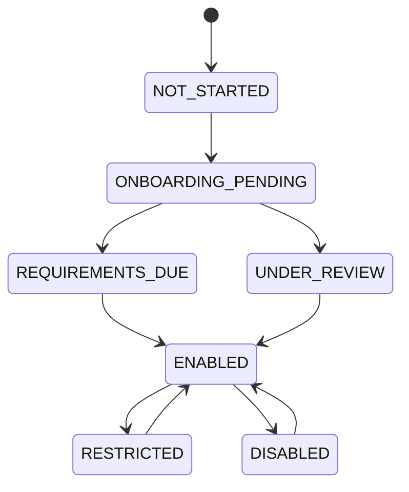
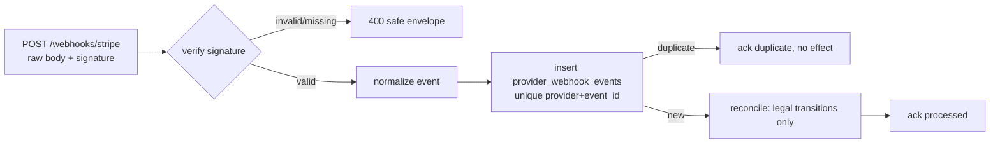

# Phase 7 Production Payments & Operator Financial Onboarding

## Business purpose

Phases 5 and 6 established a provider-neutral payment core (no real money) and the
aviation marketplace-admission boundary. Phase 7 connects the payment core to a
**real Stripe Connect architecture — in Stripe TEST MODE ONLY** — and adds the
**operator financial-onboarding** boundary that answers a new question, distinct
from aviation admission: **"Can this operator receive money through the payment
provider?"**

No real funds move in this phase. The work is deliberately structured so that a
future licensed-PSP configuration (live mode, a different provider, payout design)
can be introduced behind the same boundaries without rewriting the domain.

## What Phase 7 is — and is not

- It **is** a real Stripe adapter, real webhook verification, a real financial
  onboarding lifecycle, an SCA-capable authorization flow, and a financial
  eligibility gate for PSP-backed payments.
- It **is not** money transmission, payouts, Merchant-of-Record, dispute
  adjudication, tax/VAT, or a KYC/AML engine. Those are explicit specialist-review
  gates (ADR-035), not solved problems.

## Stripe is an adapter, not the domain (ADR-031)

The Phase 5 provider-neutral `PaymentProvider` port is unchanged in spirit.
Phase 7 adds a `StripeConnectPaymentProvider` implementing it, backed by a thin
injectable `StripeGateway` seam over the pinned official SDK:

```
API → PaymentService → PaymentProvider (port)
                          ├── FakePaymentProvider        (default; no money, no network)
                          └── StripeConnectPaymentProvider → StripeGateway → Stripe SDK (test mode)
```

- Raw Stripe objects and exceptions **never** cross the gateway. SDK errors become a
  typed `PaymentProviderError` with a stable `ProviderErrorCategory`; the API
  renders a fixed safe message, so no provider text (which could echo a key) leaks.
- Each payment **pins** its `payment_provider` kind (`FAKE` / `STRIPE`) at creation,
  so every later command routes to the provider that created the intent.
- CI and unit/integration tests use the fake gateway — **no Stripe network or
  credentials required**.

## Test-mode-only, enforced and fail-closed (ADR-031)

Typed settings enforce test mode rather than trusting configuration:

| Setting | Default | Meaning |
| --- | --- | --- |
| `STRIPE_ENABLED` | `false` | App boots and all tests run with no Stripe config |
| `STRIPE_SECRET_KEY` | `None` | Required when enabled; never logged/returned |
| `STRIPE_WEBHOOK_SECRET` | `None` | Required when enabled; distinct from the secret key |
| `STRIPE_TEST_MODE_REQUIRED` | `true` | Rejects live keys when set |

When `STRIPE_ENABLED` is set, a secret key **and** a webhook secret are required,
and a live key (`sk_live_` / `rk_live_`) is **rejected** while test mode is
required. The key value is never echoed in the error. There is **no silent fallback
to the fake** when Stripe is requested but misconfigured — it fails closed.

## Operator financial onboarding — a separate domain (ADR-032)

Financial onboarding lives in its own bounded context (`modules/financials`) and
never touches Phase 6 aviation compliance.



- The `OperatorConnectedAccount` status is **derived** from the provider's reported
  capability snapshot (charges/payouts enabled, requirements due, disabled reason) —
  it never mirrors a Stripe internal string one-for-one.
- Onboarding is **provider-hosted**. Sky Bridge Jet stores **no** bank account,
  identity document, or beneficial-owner data, and runs **no** independent
  KYC/KYB/AML/sanctions engine. The connected-account reference is an identifier,
  not a secret.
- Existing operators have **no** connected account and are therefore financially
  `NOT_STARTED` — no auto-approval, no fabricated provider reference.

### Financial eligibility gate (ADR-032)

`OperatorFinancialEligibility` is a separate, explainable decision (eligible +
typed reasons such as `NO_CONNECTED_ACCOUNT`, `REQUIREMENTS_DUE`,
`PAYOUTS_RESTRICTED`, `ACCOUNT_DISABLED`). A **Stripe-backed** payment requires the
operator to be financially onboarded (`ENABLED`); the **fake** path is unaffected,
preserving all Phase 5 behavior. This gate is **additive** to Phase 6: a financially
enabled but aviation-suspended operator is still blocked by the aviation gates, and
onboarding never mutates aviation state.

## Authorization, SCA, and capture (ADR-034)

The SCA intermediate state is represented **without** altering the `payment_status`
enum (avoiding an irreversible `ALTER TYPE ADD VALUE`):

- A provider `REQUIRES_ACTION` outcome keeps the payment `CREATED`, sets
  `requires_customer_action = true`, records `provider_status`, and returns a
  one-time `ClientAction` (action type + client secret) as **transient, non-persisted**
  data. The client secret is never stored or logged.
- A later **verified webhook** transitions `CREATED → AUTHORIZED`.
- **Capture remains gated on a `CONFIRMED` booking** (Phase 5, ADR-021). An
  `AUTHORIZED` payment on a still-`PENDING` booking is valid; the adapter must not
  capture merely because Stripe reports an authorization. Void ≠ refund.

## Webhooks: verify → normalize → reconcile → domain (ADR-033)



- Signature is verified on the **raw body** before any parsing; invalid/missing is
  rejected (400), and the endpoint is a no-op (503) until Stripe is configured.
- Idempotency is **database-enforced** by unique `(payment_provider,
  provider_event_id)`; duplicate and concurrently-raced deliveries are acknowledged
  without re-applying effects.
- Only **legal domain transitions** are applied, so replayed/out-of-order events
  never double-capture, double-refund, or regress state. The event record is
  **data-minimized** — no raw payload, no card or secret material.

## Money integrity

All amounts remain **integer minor units** (ADR-013) — no floats — and are tested at
large magnitudes (> EUR 100k). The Phase 5 commercial separation is preserved
end-to-end (operator amount / platform fee / tax / customer total / captured /
refunded / settlement eligibility). Capture is never treated as "operator paid," and
customer total is never treated as "platform revenue."

## Migration 0008

`20260811_0008` adds the `payment_provider_kind`, `financial_onboarding_status`, and
`webhook_processing_status` enum types; the `payment_provider` (backfilled to
`FAKE`), `provider_status`, and `requires_customer_action` columns on `payments`;
and the `operator_connected_accounts` and `provider_webhook_events` tables. It is
forward-only, reversible, and `alembic check` reports no drift. Existing operators
remain financially `NOT_STARTED`.

## Deferred (specialist-review gates — ADR-035)

Transfers/payouts (no scheduler; provider transfer is not a source of truth),
Merchant-of-Record, disputes/chargebacks, tax/VAT, PSD2/SCA legal applicability, and
KYC/KYB/AML/sanctions are documented deferrals, not implemented claims. The separate
charge-and-transfer flow is a **candidate**, not the final legal money-movement
design.

## Testing (three levels)

1. **Pure domain / fail-closed** — onboarding status derivation, eligibility
   reasons, and live-key rejection (no DB, no Stripe).
2. **Adapter with mocked boundary** — the real Stripe adapters mapped against a fake
   `StripeGateway` (statuses, SCA, error categories, idempotency-key prefixing).
3. **PostgreSQL integration** — onboarding lifecycle and eligibility, the financial
   gate, SCA + verified/duplicate/out-of-order webhooks, concurrency on real
   PostgreSQL, and large-value money — plus the Phase 2–6 suites, which still pass
   and never require Stripe.

## Related ADRs

ADR-031 (Stripe adapter, test-mode fail-closed), ADR-032 (financial onboarding
domain), ADR-033 (webhook ingestion), ADR-034 (SCA representation), ADR-035
(deferrals). Builds on ADR-013, ADR-020–025 (payments) and ADR-026–030 (compliance).
