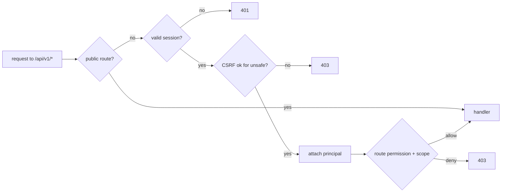

# Phase 8 Identity, Access & Organizations

## Business purpose

Phases 2–7 built a transaction backbone (customers, operators, offers, bookings,
payments, financial onboarding) with **no authenticated human identity**. Phase 8
establishes the chain the platform previously lacked:

**identity → authentication → organization membership → role → permission →
authorized business action.**

It lets the system answer: *Who is this human? Which organization(s) do they belong
to? On whose behalf are they acting? What are they allowed to do? May they act on
**this** specific resource?* Authentication and authorization become real
application boundaries, not documentation placeholders.

## Identity is not the commercial entity (ADR-036)

```
User ──< OrganizationMembership >── Organization ──(by reference)──> Customer / Operator
                                     (CUSTOMER / OPERATOR / PLATFORM)
```

- **`User`** — opaque UUID PK (email is not the key), unique by case-normalized
  email, minimal PII, lifecycle `PENDING_VERIFICATION → ACTIVE → SUSPENDED /
  DISABLED`. A non-`ACTIVE` user exercises no privilege; disabling never deletes
  audit history.
- **`Organization`** — `CUSTOMER`, `OPERATOR`, or `PLATFORM`, optionally linked
  one-to-one **by reference** to an existing `customers.id` / `operators.id`. The
  Phase 2–7 aggregates are reused, never rewritten.
- **`OrganizationMembership`** — a user's role in an organization; one `ACTIVE` per
  (user, org) via a partial unique index; revocation is soft (history retained) and
  immediately removes derived authorization.

This deliberately supports **one Customer operated by many users** (family office /
PA) and **one Operator with many staff**, without assuming one login = one entity.

## Authentication & sessions (ADR-037)

- **Argon2id** password hashing via `argon2-cffi` — we never implement crypto.
  Plaintext is never stored or logged.
- **Server-side sessions**: opaque token to the client, only its **SHA-256 hash**
  stored. Expiry, single logout, revoke-all, and immediate invalidation on user
  suspension. Reset invalidates all sessions.
- **Cookies**: `HttpOnly`, `SameSite=Lax`, bounded lifetime; `Secure` in production
  (validator forbids disabling it there). No tokens in `localStorage`.
- **CSRF**: per-session secret echoed in `X-CSRF-Token` on unsafe requests, validated
  server-side — not reliant on `SameSite` alone.
- **Verification / reset / invitation** tokens are single-use, expiring, stored only
  as hashes, never logged. Reset initiation and login are **enumeration-safe**.

## Authorization: RBAC + resource scope (ADR-038)

Every decision is one call:

```
authorize(principal, permission, scope)   # WHO + WHAT + WHICH TENANT → allow / raise
```

- **Permissions** are a stable vocabulary; roles map to permission sets in one
  testable matrix. Callers never check role strings.
- **Scope** is `GLOBAL`, `CUSTOMER(id)`, or `OPERATOR(id)`. A platform role is
  cross-tenant only for the permissions it grants; a customer/operator role is
  confined to its linked tenant — so `CUSTOMER_OWNER` A cannot read B's trips.
- **`PRODUCT_OWNER`** is the single documented, audited high-privilege role (a
  permission superset), not a scattered bypass.
- Default roles are kept small to avoid role explosion. The full permission matrix is
  the source of truth in `iam/domain.py`.

### Permission matrix (summary)

| Role | Representative permissions |
| --- | --- |
| CUSTOMER_OWNER | customer.read/write, trip.read/write, booking.read, payment.read/initiate, org.membership.manage |
| CUSTOMER_ASSISTANT | customer.read, trip.read/write, booking.read, payment.read/initiate |
| OPERATOR_ADMIN | operator.manage, offer.manage, booking.decide, compliance.evidence.submit, financial_onboarding.*, org.membership.manage |
| OPERATOR_SALES / OPERATIONS / FINANCE / COMPLIANCE | offer.manage / booking.decide / financial_onboarding.* + payment.read / compliance.evidence.submit |
| PLATFORM_COMPLIANCE_REVIEWER | operator.read, **compliance.review** |
| PLATFORM_FINANCE_REVIEWER | payment.read/refund, finance.review, financial_onboarding.read |
| PLATFORM_ADMIN | admin.users/organizations.manage, reads, compliance.review, finance.review, payment.refund, financial_onboarding.* |
| PRODUCT_OWNER | every permission |

## API security migration (ADR-039)



- **Fail closed globally**: the authentication gate is a dependency on the whole
  `/api/v1` router — every route is authenticated unless explicitly PUBLIC. Public =
  auth initiation/recovery, the signature-verified Stripe webhook, and airport
  discovery.
- **High-consequence bindings**: compliance review requires `compliance.review` (an
  **operator can never approve its own admission**; a customer can never review);
  financial onboarding is operator-scoped; refunds require `payment.refund`;
  org/user admin requires `admin.*`.
- **Route classification**: PUBLIC / AUTHENTICATED / CUSTOMER-SCOPED /
  OPERATOR-SCOPED / PLATFORM-REVIEWER / PLATFORM-FINANCE / PLATFORM-ADMIN, covered by
  regression tests (allow and deny paths).

## Memberships, invitations, safety rails

- Organization admins invite by email (hashed, single-use, expiring token bound to
  the invited identity), list members, change roles **within policy**, and revoke.
- **Privilege-escalation prevention**: role must be valid for the org type, and a
  non-platform admin cannot grant a role beyond its own permissions (an Operator
  Admin cannot mint a `PLATFORM_ADMIN`; a Customer Owner cannot create Operator
  membership).
- **Last-admin protection**: an organization cannot lose its final active admin.

## Bootstrap (first product owner)

A one-time CLI (`python -m sky_bridge_jet.modules.iam.bootstrap --email …`) creates
the first `PRODUCT_OWNER` and the platform organization. The password comes from
`SBJ_BOOTSTRAP_PASSWORD` or an interactive prompt — never a CLI argument, never a
committed default. It refuses to run once a product owner exists, is auditable, and
is **not** an HTTP endpoint (no unauthenticated "make me admin" route).

## Audit & abuse

- An append-only `auth_audit_log` records security-sensitive events (registration,
  verification, login success/failure, logout, reset, session revoke, membership
  lifecycle, status changes). It **never** stores passwords, session secrets, tokens,
  raw cookies, Stripe secrets, or PII bodies.
- Auth endpoints have a minimal in-process rate-limit floor (login, reset). This is
  an application floor; production still fronts these with a reverse-proxy / WAF.

## Data & migrations

Migration `20260813_0009` creates the identity/access enums and tables
(`users`, `organizations`, `organization_memberships`, `user_sessions`, the
single-use token tables, `organization_invitations`, `auth_audit_log`). It is
forward-only and reversible, `alembic check` reports no drift, and it fabricates no
users or organizations — existing data is untouched.

## Testing (three levels)

1. **Pure unit** — Argon2/token primitives and the authorization policy
   (allow/deny, scope isolation, product-owner superset) with no DB or HTTP.
2. **HTTP flow (DB)** — register → verify → login → session → logout, CSRF,
   enumeration-safety, reset, suspension, rate limiting; membership invite/accept/
   role-change/revoke with escalation and last-admin guards; the bootstrap invariant.
3. **PostgreSQL integration** — concurrency (revoke-all vs protected action, unique
   active-membership race, role downgrade removing permission immediately) on the
   real database. Phase 2–7 suites still pass, now authenticating through the
   enforced gate.

## Deferred (documented boundaries)

Passkeys/WebAuthn and MFA/TOTP are architected-for but not implemented; production
internal/admin roles should require stronger authentication when MFA lands. Real
email delivery is deferred to the Notification phase. Full per-resource ownership on
every remaining Phase 2–7 CRUD route extends the same `authorize(..., scope)` pattern
in follow-up work.

## Related ADRs

ADR-036 (identity & organizations), ADR-037 (authentication & sessions), ADR-038
(RBAC + resource scope), ADR-039 (API security migration). Builds on ADR-030
(human-authorized review) and the Phase 6/7 gates.
